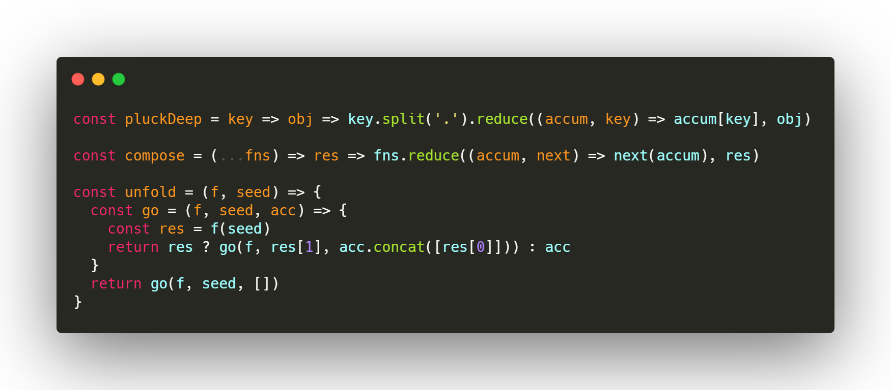

# DW-Theme
## DW-Theme für Visual Studio Code
Schöne Funktionalität für professionelle Entwickler.

DW-Theme ist ein Farbschema, ein benutzerdefiniertes Benutzeroberflächendesign und ein vollständiger Symbolsatz für Visual Studio Code. Es wurde vom Autor der ursprünglichen Monokai-Farben entworfen. Sorgfältig ausgewählte Farbschattierungen bilden die Grundlage für eine kompromisslose, nicht ablenkende Benutzeroberfläche. Das einzige Ziel von DW-Theme besteht darin, dass Sie sich auf Ihren Code konzentrieren können.

### Für mehr Informationen
* [Homepage](https://wetter.dev)
* [Source Code](https://github.com/davidwetter/vsc-theme)

**Viel Spass!**
